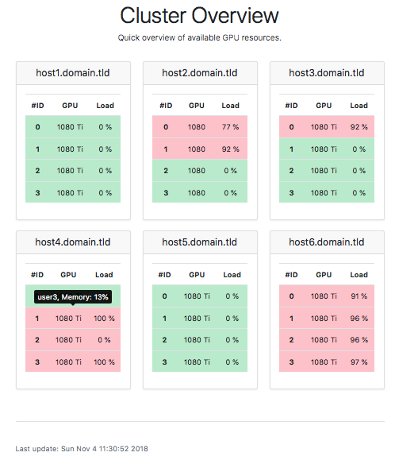

# Web-GPU-Monitor

Simple server monitoring for your GPU cluster.
Periodically calls `nvidia-smi` through SSH and parses it into a website.
The generated website highlights the available GPUs in green and shows the
GPU load.
Occupied GPUs are marked in red. By hovering the entry with your mouse,
it will show you the users which have processes on the machine and how much
GPU memory is consumed.



## Setup

You need to satisfy some Python dependencies. Start by creating a conda environment with Python3.6.

```
conda create -n web-gpu-monitor python=3.6
```

Then, activate the environment with `conda activate web-gpu-monitor` and install the dependencies with

```
pip install -r requirements.txt
```

## Getting Started

First step is to create a `config.ini` where your credentials and hostnames are specified.

An exemplary ini-file could look like this:

```ini
[common]
user = yourusername
hosts = host1.domain.tld,host2.domain.tld
key_filename=path_to_key
```

Save this as `config.ini` in the root of this repository.

Now you can run `python fetch_data.py -c config.ini` to fetch data from
your specified hosts. The result is then saved in `load_data.csv`.
Call `python render_website.py` to create a HTML site out of it.
The result is stored in `index.html`.

## Website Configuration

To make the monitoring service available in a website, you will first have to configure an HTTP server. We recommend nginx (simply run `sudo apt install nginx` followed by `sudo systemctl enable nginx` and `sudo systemctl start nginx`). Then, you should put the `index.html` file and the `assets` directory somewhere under `/var/www`. 

In our case, we have put it under `/var/www/gpu-monitor`, and updated the config file at `/etc/nginx/sites-available/mlkd` accordingly by inserting the following lines:

```nginx
  location ^~ /gpu-monitor {
    alias /var/www/mlkd/gpu-monitor;
    try_files $uri $uri.html $uri/ =404;
    index index.html;
  }
```

In our case, the name of the config file is `mlkd` because of some other stuff we're hosting, but usually you can use the `default` config file or a new custom one.

To keep the files under the `/var/www/gpu-monitor` directory updated, we created soft links from there to the place where they are generated, i.e.:

```bash
ln -sf /home/ubuntu/web-gpu-monitor/index.html /var/www/gpu-monitor/index.html
ln -sf /home/ubuntu/web-gpu-monitor/assets /var/www/gpu-monitor/assets
```

There were other ways to achieve this, such as regularly copying the files, but this was probably the simplest.

## Automation

The execution of these scripts can be done using a cronjob. For code at `/home/ubuntu/web-gpu-monitor`, and a conda environment with Python at `/home/ubuntu/.conda/envs/web-gpu-monitor/bin/python` and to run it every 5 minutes, run `crontab -e` to edit the crontab, and insert the lines below:

```bash
*/5 * * * * cd /home/ubuntu/web-gpu-monitor/ && /home/ubuntu/.conda/envs/web-gpu-monitor/bin/python /home/ubuntu/web-gpu-monitor/fetch_data.py -c config.ini && /home/ubuntu/.conda/envs/web-gpu-monitor/bin/python /home/ubuntu/web-gpu-monitor/render_website.py
```

Note: you need to make sure the user running the script has write access to the 

You will need a user that can access all machines and call `nvidia-smi`. In our cluster, that user is `gpu_monitor`.
